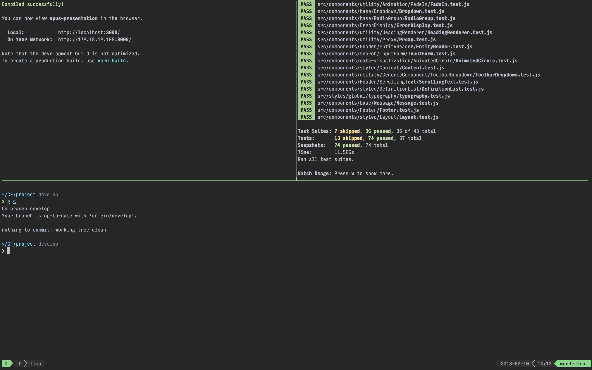
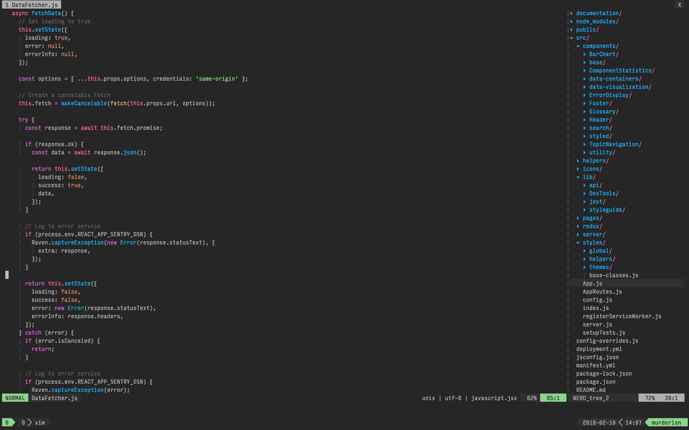

# dotfiles

> 🛠 fish shell, CLI tooling, Git, Vim/Tmux for JS/React, sensible macOS defaults




## Shell

[`fish`](https://fishshell.com/) is used as the shell environment.

Why `fish` and not `bash` or `zsh`?

* Zero config, basic setup is sufficient.
* Syntax highlighting
* Inline auto-suggestions
* But most of all, it's _really_ fast.

### Plugins

Plugins are managed by [`fisherman`](https://github.com/fisherman/fisherman).

I recommend to quickly take a look at [this](https://github.com/fisherman/fisherman/issues/69) issue to see the advantages of using `fisherman` over `oh-my-fish`.

The following plugins are added upon [installation](#install).

* [`thefuck`](https://github.com/nvbn/thefuck) _(Magnificent app which corrects your previous console command.)_
* [`bass`](https://github.com/edc/bass) _(Make Bash utilities usable in Fish shell)_
* [`nvm`](https://github.com/creationix/nvm) _(Node Version Manager - Simple bash script to manage multiple active node.js versions)_
* [`z`](https://github.com/rupa/z) _(jump around)_
* [`pure`](https://github.com/rafaelrinaldi/pure) _(Port of the `pure` ZSH prompt to Fish 🐟)_

## Git

[mingit](https://github.com/evansendra/mingit) aliases are included.

```
a = add
b = branch
c = commit
cm = commit -m
co = checkout
d = diff
f = fetch
i = init
m = merge
s = status
```

See [`.gitconfig`](https://github.com/Murderlon/dotfiles/blob/master/.gitconfig) for additional included settings.

> **Note:** if you use my `.gitconfig` don't forget to change credentials under `[USER]`

**TIP:** an alias I personally can't live without.

```bash
alias g "git"; and funcsave g;
```

## Tmux

Nothing special going on here, in [`.tmux.conf`](https://github.com/Murderlon/dotfiles/blob/master/.tmux.conf) I change the tmux prefix and use [`tpn`](https://github.com/tmux-plugins/tpm) (Tmux Plugin Manager) to add [`tmux-sensible`](https://github.com/tmux-plugins/tmux-sensible). Also, the snapshot file for [`tmuxline`](https://github.com/edkolev/tmuxline.vim) is sourced there.

## Vim

### Included Plugins

I recommend reading the docs of these plugins to understand them better. Each plugin provides a much better Vim experience!

* [ack.vim](https://github.com/mileszs/ack.vim): Vim plugin for `the_silver_searcher` (ag) or ack -- a wicked fast grep
* [bufexplorer.zip](https://github.com/vim-scripts/bufexplorer.zip): Quickly and easily switch between buffers. This plugin can be opened with `<leader+o>`
* [ctrlp.vim](https://github.com/ctrlpvim/ctrlp.vim): Fuzzy file, buffer, mru and tag finder. It's mapped to `<Ctrl+F>`
* [goyo.vim](https://github.com/junegunn/goyo.vim) and [vim-zenroom2](https://github.com/amix/vim-zenroom2):
* [lightline.vim](https://github.com/itchyny/lightline.vim): A light and configurable statusline/tabline for Vim
* [NERD Tree](https://github.com/scrooloose/nerdtree): A tree explorer plugin for vim
* [mru.vim](https://github.com/vim-scripts/mru.vim): Plugin to manage Most Recently Used (MRU) files. This plugin can be opened with `<leader+f>`
* [open_file_under_cursor.vim](https://github.com/amix/open_file_under_cursor.vim): Open file under cursor when pressing `gf`
* [pathogen.vim](https://github.com/tpope/vim-pathogen): Manage your vim runtimepath
* [snipmate.vim](https://github.com/garbas/vim-snipmate): snipmate.vim aims to be a concise vim script that implements some of TextMate's snippets features in Vim
* [syntastic](https://github.com/scrooloose/syntastic): Syntax checking hacks for vim
* [vim-commentary](https://github.com/tpope/vim-commentary): Comment stuff out. Use `gcc` to comment out a line (takes a count), `gc` to comment out the target of a motion. `gcu` uncomments a set of adjacent commented lines.
* [vim-expand-region](https://github.com/terryma/vim-expand-region): Allows you to visually select increasingly larger regions of text using the same key combination
* [vim-fugitive](https://github.com/tpope/vim-fugitive): A Git wrapper so awesome, it should be illegal
* [vim-indent-object](https://github.com/michaeljsmith/vim-indent-object): Defines a new text object representing lines of code at the same indent level. Useful for python/vim scripts
* [vim-multiple-cursors](https://github.com/terryma/vim-multiple-cursors): Sublime Text style multiple selections for Vim, CTRL+N is remapped to CTRL+S (due to YankRing)
* [vim-yankstack](https://github.com/maxbrunsfeld/vim-yankstack): Maintains a history of previous yanks, changes and deletes
  Remove all clutter and focus only on the essential. Similar to iA Writer or Write Room.

After you have [installed](#install) the setup, you can create **~/.vim_runtime/my_configs.vim** to fill in any configurations that are important for you. For instance, my **my_configs.vim** looks like this:

```vim
" make .jsx extension not required for JSX syntax highlighting
let g:jsx_ext_required=0

" Remove mode indication (already provided by lightline)
set noshowmode

let g:lightline = {'colorscheme': 'onedark'}
" Always use the lightline theme declared above
let g:tmuxline_theme = 'lightline'

colorscheme onedark

" Disable folding
set nofoldenable
```

You can also install your plugins, for instance, via pathogen you can install [vim-rails](https://github.com/tpope/vim-rails):

```
cd ~/.vim_runtime
git clone git://github.com/tpope/vim-rails.git plugins/vim-rails
```

### Key mapping

Key mappings are almost identical to [amix/vimrc](https://github.com/amix/vimrc#key-mappings) so I recommend to take a look at his docs.

## Installation

<a name="install"/>

You need [Homebrew](https://brew.sh/) as a prerequisite for these scripts.

If you want the entire setup, simply run this script.

```
./install
```

### Shell

Checkout [`.shell.sh`](https://github.com/Murderlon/dotfiles/blob/master/.shell.sh) to see the installation process.

```
./.shell
```

### Vim / Tmux

Move the following files to your user folder.

* `.vimrc`
* `.tmux.conf`
* `.tmuxline`
* `.vim_runtime/`

### macOS

Sensible macOS defaults. See [`.macOS.sh`](https://github.com/Murderlon/dotfiles/blob/master/.macOS.sh) to find out what that entails.

```
./.macOS
```

## Todo

* Add [vim-prettier](https://github.com/prettier/vim-prettier).
* Setup eslint for vim.
* Further improve vim for React and CSS-in-JS.

## Credits

[Mathias Bynens](https://github.com/mathiasbynens) / [dotfiles](https://github.com/mathiasbynens/dotfiles) _(bash installer scripts)_

[Amir Salihefendic](https://github.com/amix) / [vimrc](https://github.com/amix/vimrc) _(vim mapping and plugins)_

## License

[MIT](https://oss.ninja/mit/murderlon) © [Murderlon](https://github.com/Murderlon).
